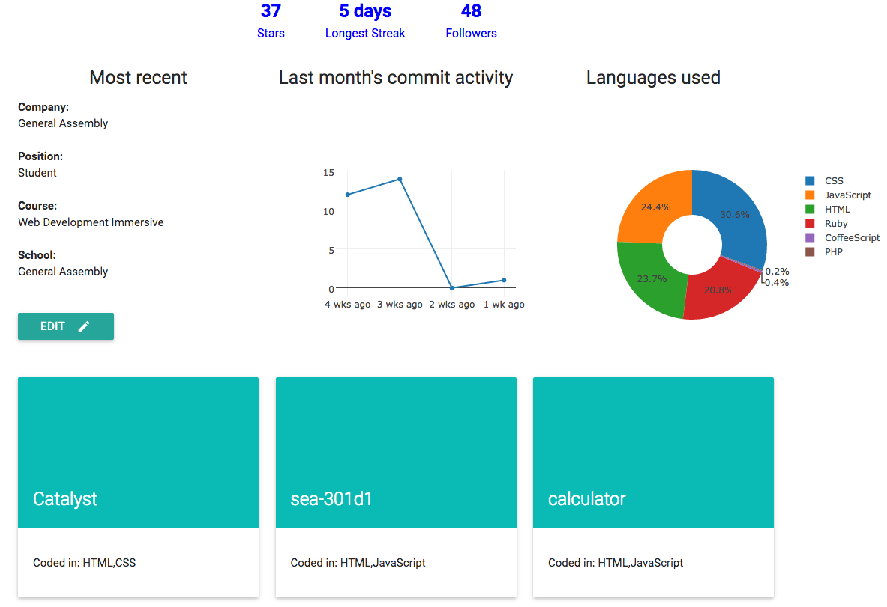

# DevHub
A "LinkedIn" for Developers using the Github API with processed stats and data visualisation. 

### Overview

### What was used
- Github API (https://developer.github.com/v3/repos/statistics/)
- Mongoose (database)
- Express
- Node.js
- Materialize for CSS Styling

### Approach Taken
- We wanted to display more meaningful data for developers using raw data provided by the Github API. This would make it easier to gauge the Developer's experience and find developers working on the same langugage/framework. 
- Data displayed include:
    - Most recent job and education details
    - Past month's commits
    - Summary of languages used across all repositories
    - Star projects

### Usage Instructions
- To run locally, in the project folder, run "mongod" and "node app.js".
- Login with Github to fetch data. 
- The app is also deployed on Heroku - (http://devhub-.herokuapp.com/)

### Future Development
- Social logins and network
    - Users can be authenticated through Facebook/Twitter/Google logins.
    - Visitors to the site will be able to save their searches and results. 
    - Developers will be able to connect to each other. 
- Other APIs
    - Possiblity of adding on other APIs which provide more user details (e.g. job experience, education)
